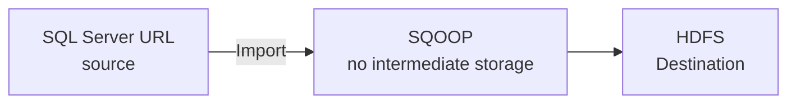
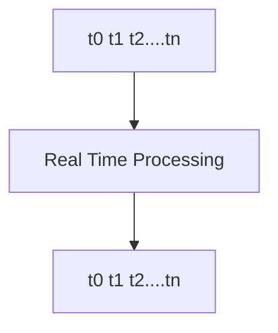
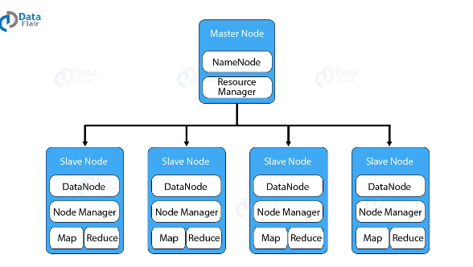
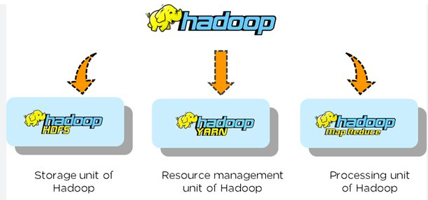
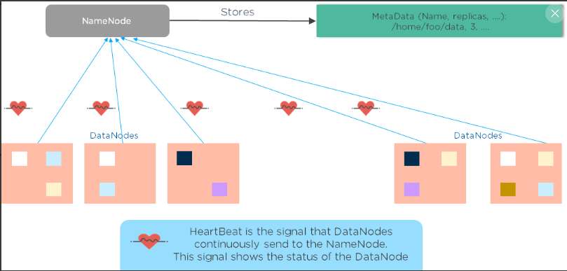

# Introduction to Big Data
Big Data refers to extremely large data sets that may be analyzed computanionally to reveal patterns, trends and associations, especially relating to human behaviour and interactions.

## sectors
* Banking 
    * Credit score
    * investment and insurance pakcages
    * pre approved loans

* Healthcare
    * Using img/images (MRI, CT, Xray) and reading (EEG, ECG),
    early forecast of health issues can be found
    * personalised food recommedations
    * using firness band, they can analys our workout patterns as well as step count, SPO2, heartbeat rate and make inferences.

* Energy
    * EV + Hybrid: forecast the EV requirement
    * EV buses

* Technology
    * Advertisement

* Consumer
    * Forecast product demand
    * Managing logistics (Zepto, Instamart, Bigbasket)

* Manufacturing
    

## Challenges of Traditional Decision-Making

* Takes a ling time to arrive at a decision, therefore losing the competitive advantage.

* Requires human intervention at various stage. --> Regular failures of machine.

* Lack Systematic linkage among strategy, planning, execution, and reporting, due to limitation of storage and cost cutting.

* Provides limited scope of data analytics, that is, itprovides only a bird's eye view.

* Obstructs company's ability to make fully informed decisions.

## The Big Data Analytics
* The decision - making is based on what you know which in turn is based on data analytics

* It provides a comprehensive view of the overall prictures which is is a result of analyzing from various sources.

* It provides streamlines decision - making from top to bottom

* Big Data analytics helps in analyzing unstructures data.
 
* It helps faster decision-making thus improving the competitve advantage and saving time and energy.

## 4 V's

* Volume - amount of data
* Variety - Different types of data
* Velocity - rate at with data is generated
* Veracity - Truthfullness of Data
* Value  - Data must provide information that add value to company.

## Different Types of Data
* **Unstructured** : Data that has no inherent structure and is usually stores as different types of files.

    > Example - txt, pdf, img

* **Quasi - Structured** : Textual data will erratic formats that can be formatted with effort and software tools. 

    > Example - Clickstream Data

* **Semi Structured** : Textual data files with an apparent pattern, enabling analysis.

     > Example - CSV, JSON and XML files

* **Strutured** : Data having a defined data model, format structure. 

    > Example - Database

--------------------------------------------------------------------

1. ### Scoop (Not in syllabus)

    Import and export data from source (Structured source) to destination(HDFS). it is bi directional

    ```mermaid
    graph TD;
        Database --> Scoop--> HDFS;
        HDFS-->Scoop-->Database;
    ```

2. ### Flume 

    Flume is also used for migrating data from URL (live streaming source) and collect it to store in HDFS (Storage layer)

    ```mermaid
    graph LR
        A[Source URL] -->B[HDFS]
        
    ```


# Data Processing Layer
### **Batch Processing**



### **Real Time Processing**


----------------------------------

### **Scalability in Big Data**

* Adding resources to distributed system(scaling up).

* A scalable data platform accomodates rapid changes in the growth of data,either in traffic or volume.

* It utilizes and adds hardware or software to increase the output and storage of data.

* When a company has a scalable data platform. It is prepared for the potential of growth in its data needs.


### **Fault Tolerance in Big Data**

* Fault Tolerance in Big Data or HDFS refers or


### **Data Inconsistence in Big Data**

* Monitoring every change in the data.

* Once data is captured in **big data, inconsistent** or conflicting phenomena can occor at varous granulatiies

* it occurs from knowledge content, data, information, knowledge, meto-knowledge, to expertise and can adversely affect the quality of outcomes in big data analysis process.


> ### **Distributed Systems**
>
> A distributed system is a model in which components located on networked computers communicate and coordinate their actions by passing messages.


# **Hadoop**


> Hadoop is a framework that allows distributed processing of large datasets across clusters of commodity computers using simple programming models.


### **Characteristics of Hadoop**

* Scalable
    > Can follow both horizontal vertical scaling
* Flexible
    > Can store huge data and decide to use it later.
* Economical
    > Can use ordinary computers for data processing.
* Relaible
    > Stores copies of data on different machines and is resistant to hardware failure


| RDBMS    |     |   Hadoop         |
| -------- | ------- | ----     |
| Structured  | DataTypes    |  Multi and Unstructred        |
| Limited, No data Processing | Processing     | Processing coupled wiht Data         |
| Standards and Structured    | Governance    | Loosely Constructed         |
| Required on Write | Schema | Required on Read |
| Reads are Fast | Speed | Write are Fast (Read many write once)|
| Software License | Cost | Support Only |
| Known Entity | Resources | Growing, Complexities, Wide |
| OLTP Complex ACID Transactions OPerational Data Store | Best Fit Use | Data Discovery Processing Unstructred data massive Storage/ Processing |


# Hadoop Configuration
### 1. Modes of Hadoop Configuration

* Standalone Mode
    > All hadoop services run in a single JVM on a single machine.
* Pseudo-distributed mode
    > Each hadoop runs on its own JVM, but on a single machine.
* Fully Distributed mode
    > Hadoop services runs on individual JVM, but these reside in separate commodity machine in single a cluster.

### 2. Hadoop Cluster



### 3. Components of Hadoop



### 4. HDFS Architecture
> Hadoop Distributed File Sytem(HDFS) is one of the key component of Hadoop Ecosystem, designed to store and manage large volume od data across a distributed network of machines. Its Architecture is designed to handle high throughput access to data and provide fault tolerance and high scalabilty.

* HDFS has default block size of 128MB, So if file size is 512MB,file will be separated into 4 blocks.
* All data blocks will be replicated into 3 blocks.
* NameNode tries to access nearest data node while performing read and write operations.
* If any datanode goes down the data blocks which are present will be replicated on all the other data nodes.


#### HDFS Architecure Component
> 1. **NameNode:**
\
    > It act as master server that manages metadata of the file system.

> 2. **DataNode:**
\
    > Act as a worker node and it keep the actual block of data.

> 3. **Secondary NameNode:**


#### Concept of Multiple NameNode

*  Active namenode
* Secondary NameNode

## High Availability Architecture


> **Checkpointing**:  The primary function of secondary NameNode is to perform checkpointing. It involves periodically merging NameNodes's edit log (changes in the file system) with current file system (**FSimg/image**).

* Name Node keeps edit log of all modifications made to the file system. Over time, this log can grow large, hence secondary namenode helps to convert this edit logs into file system (FSimg/image) by creating checkpointing.
Overtime if edit logs can grow large, name node will take more time to convert it into FSimg/image by restarting it, during this phase cluster will be down.

* Secondary helps in reducing recovery time of the cluster. Due to checkpointing the downtime of cluster minimizes.

> **FSimg/image** - FileSystem Namespace 
    > * Path to file system in cluster's Data node.(replicas, replica path, file system etc.)
/
    > * The older version of Hadoop Distributed File System(HDFS), cluster used to be down frequently, as logs and FSimg/image used to take lot of space in Memory(RAM). Due to shortage of RAM cluster used to go down.
    > *  This got resolved  in Hadoop 2 after introducing secondary Namenode concept.

> **Zookeeper**
    > * It acts as coordinator, that will monitor health of Active namenode and it makes the decision of automatic fail over where it will replace existing NameNode with Standby Namenode.

> 


