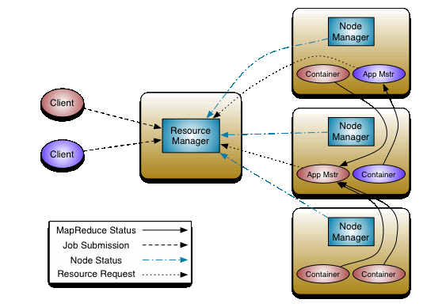
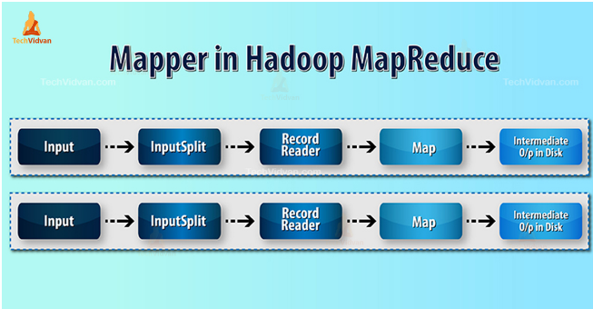
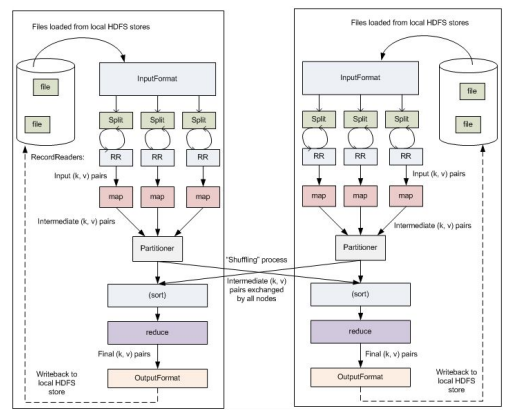

# Hadoop

## General FAQ's
- **How does hadoop achieve Fault tolerance?**
    > * Replicas of data blocks across multiple nodes.
    > * Secondary Namenode (multiple namenodes).

- **If a filesize is 129MB, how many datablocks will it create in HDFS?**
    > 2 blocks (128+128)

- **How does hadoop handles data consistency?**
    > **write once and read many** - Once a file is written in HDFS, it cannot be modified. It can only be deleted and replaced. It ensures that all datanodes read the same version of the file.

- **How does YARN differ from original MapReduce framework in Hadoop v1?**

    > In original mapreduce framework(v1), only job tracker was responsible for both resource management and job scheduling and this led to scalablity issues and regualar job tracker failures due to overburden of task.
    \
    In Yarn, application manager, node manager and app master was introduced.

- **Suppose mapreduce job has 10 map tasks and 5 reduce tasks. if one of the node running map fails. What impact will it have on overall job execution and how does hadoop handles it?**

    > If a node running a map task fails, hadoop will reschedule failed map task on another availble node.
    The system ensure job continues by rerunning only failed map task. The fault tolerance mechanism ensure that overall job execution is resilient to individual node failure.

- **In a hadoop cluster multiple applications are running simultaneously, what would be impact of increasing replication factor of HDFS on overall system performance.**

    > * **Positive :** Improve data reliablity and fault tolerance by storing more copies.
    > * **Negative :** Storage Utilization, write performance (more files will perform write operations), Network Traffic (High network traffic).

- **How would you optimize performance of mapreduce job that can be running logner than expected?**

    > * Resource Allocation
    > * Data Locatlity : \
             Minimize data transfer across the network by ensuring that tasks run on nodes, where data is located.
    > * Balancing number of maps and reduce tasks that aligns with cluseter's capa


# Yarn
### Architecture


1. Job Scheduler
    * When user submits Job, it goes to Job scheduler and its schedules Job using FIFO, FAIR and Capaciy Schedulers.

    * Job Scheduler will allocate resources for the job.

2. Application Manager
    * Application Manager will accept the job from job scheduler.
    * It will request node manager to allocate containers (Resources - RAM, CPU, Netwrok, Data Blocks)
    * Application Manager will monitor job execution, if required more resources. It will request to distribute resources as required.
    * If job fails, Application manager will request to restart job.

3. Node Manager
    * Node Manager will allocate resources and App Master to monitor containers.
    * App Master will monitor resources and will negotiate about resources for running job.
    * App Master will kill itself once job is finished.
    * Node manager will send the staus of slave node using signal (heartbeat), signal sent at regular interval.

### MapReduce
> The key reason to perform mapping and reducing is to speed up the execution of a specific process by splitting a process into number of task, thus it encourages parallelism in job flow. 

* ### Input Split and Record Reader

    

    *  **Partitioner (Pre-reducer)**: It ensure same key goes to the same reducer. Determines how the output of Mapper is distributed across the reducers. It decides which key value pairs will go to which reducer. It ensures that the load among the reducer is balanced.

    * **Combiner**: It is an local reducer (optional), which performs partial aggregation of Mapper output before it send to the reducer.
    
        It reduces the volume of the data transfer between Mapper and Reducer.

        


#### To change a block size for specific file in a cluster:
```
hadoop fs -Ddfs = blocksize -put /home/hadoop/test/test.txt/hdfs
```


### Python Sys
* Python standard library
* provides functions or variables that interact directly with operating
* Common attributes are argv.
* system.exit - Exits the program with specified exit status.
* system.path - consist of list of string which specifies the search path for the modules.
* sys.Stdin - File like object that represent standard input output and is used to read input from user or input from path(directory). it is used when we want to input from CLI or from files in a more controlled way.