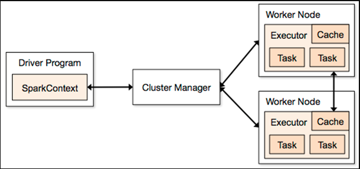

# **Apache Spark**

## Intro

* Semi Structured
    * **Formats** - ORC, Parquet, AVRO 
    
        Highly compressed file formats and queries faster than any other file formats.

* Spark produces real time processing or stream processing.

* Hadoop is desgined to handle small number of large datablocks rather than handle large number of smaller data blocks.

## Spark over MapReduce

- Batch Processing
- Structured data analysis
- Machine Learning analysis
- Interactive services
- Spark is created using scala.

## Apache Spark: Features
1. Is suitable for real time trivial operations and to process larger data on a network.
2. It is an open source cluster computing framework.
3. 100 times faster performance in in-memory operation  and 10 times faster for  in disk.
4. Suitable for ML algorithms as it allows programs to load and query data repeatedly.

## Components of Spark
Spark is an alternative to hadoop MapReduce that includes 5 components. They are
 
   - Spark SQL
        > Read various structured data like CSV, AVRO, Paruet
   - Spark Streaming
        > Enables fault tolerant processing of real time data streams.
   - Spark MLLib
        > ML algorithms and other utilities.
   - GraphX
        > Graph parallel processing.
   - SparkR
        > Enables R lang users to levarage the power of Apache spark.
   - Spark Core
        > Core engine of Apache spark framework. every other module in spark is built onm top of this.

# Apache Spark Architecture

* **Driver Program**

    > **SparkContext:**
     \
            * It is the crucial component that represents connection to the spark cluster.
\
           * It is responsible fot managing the life cycle of the spark application.
\
           * It handles allocation of resources required by executors
\
           * Handles configuration for spark application, eg. memory
\
           * RDD (Resilient Distributed Datasets)- core data structure of spark

    Entry point of the program. It creates SparkContext to schedule job execution and negotiates with the cluster manager.

* **Cluster Manager**

     * It schedules and dispatch tasks to worker node. It ensures that tasks are distributed among the worker nodes.

     * It is responsible for scaling of resources up & down depending on work load or demand

     * Handles node failures and resource reallocation for maintaining stability and reliability of the cluster.
     
     * If the job fails, the cluster manager is responsible for the rescheduling of the tasks.

     * Resource manager: Monitors and manages clusters resources efficiently.    

* **Executors**

    It uses cache slots to keep data in memory, and task slots are Java threads that run the code. Executors run tasks scheduled by the driver.

* **Worker Node**

    They are the slave nodes that execute the tasks.

-----------------

# PySpark
* Whenever we start spark shell, there are two sessions which are started by default:
     * Spark Context - Entry Point (Python + Spark)
     * Spark Session - Used to create a dataframe or SQL queries.

### Spark RDD
Spark Resilient Distributed Dataset(RDD) is an immutable collection of objects which defines the data structure of Spark. The features of Spark RDD are:

1. Lazy Evaluation
     > Parallelized Collections
     >
     > * sc.parallelize() -> Any Collection
     > * sc.textfile() -> External File
     > * rdd2 = rdd1.tranformation() 

2. Coarse-Grained Operation
3. In-Memory Computation
4. Fault-tolerance
5. Partition
     > * No. of workers
     > * rdd.partition() -> Increase no of partition
     > * rdd.coalesce() -> Reduce no of partition

6. Persistent
7. Immutable
8. Location-Stickiness

### DAG (Directed Acyclic Graph)
A DAG is a graphical repesentation of how spark will execute the program. Each vertex on the graph represent a separate operation, and the edges represemt the operation dependencies.

> Directed - One node in a graph is directly connected to another, which creates a sequence.

> Acyclic - It defines that there is no cycle or loop available.

> Graph - From graph theory, it is a combination of vertices and edges.

