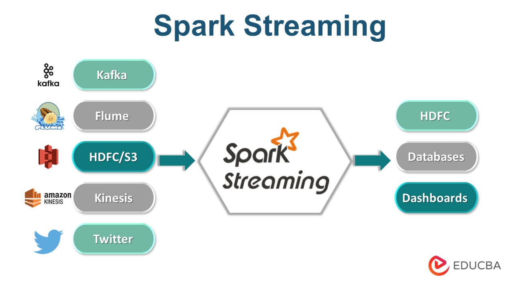

# Streaming

The continous flow of data at a high speed rate is know as streaming.

 Data Storage - HDFS(disk), HIVE(Warehouse), NoSql(Unstrcutred)

 ## Real Time layer
 -  Receives the arriving data.
 - Performs incremental updates to the batch layer results
 - Has incremental algorithms implemented at the speed layer
 - Has a significantly reduced computation cost.

 ## Introduction to Spark Streaming
 It is an extension of the core Spark API, that enables scalable, high-throughput, fault-tolerant live data stream processing.

