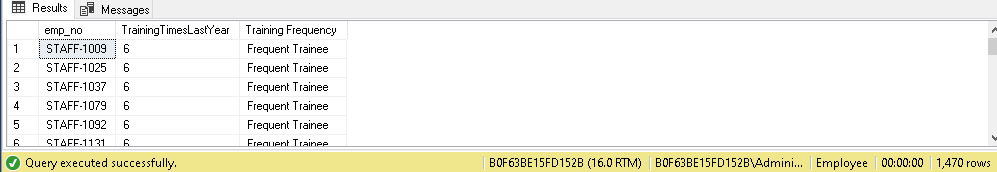

# SQL Assignment
#### A. Return the shape of the table

```
select count(*) from emp;
select count(*) from INFORMATION_SCHEMA.COLUMNS where TABLE_NAME = 'emp';
```


#### B. Calculate the cumulative sum of total working years for each department

```
select 
	Department, TotalWorkingYears, SUM(TotalWorkingYears)
	OVER(PARTITION BY Department ORDER BY TotalWorkingYears ROWS BETWEEN UNBOUNDED PRECEDING
	AND CURRENT ROW) AS TotalWorkYrSum
FROM emp
	WHERE TotalWorkingYears > 0 ;
```


#### C. Which gender have higher strength as workforce in each department.

```
SELECT Department, Gender, Gender_Count From(
SELECT
	Department, Gender, count(*) as Gender_Count,
	RANK() OVER(PARTITION BY Department 
				ORDER BY COUNT(*) DESC) AS Gender_rank
	FROM emp
	GROUP BY Department, Gender) as _
	WHERE Gender_rank = 1;
```


#### D. Create a new column AGE_BAND and Show Distribution of Employee's Age band group (Below 25, 25-34, 35-44, 45-55. ABOVE 55).

```	
SELECT
    CF_age_band, COUNT(*) AS EmployeeCount
FROM emp
GROUP BY CF_age_band
ORDER BY
    CASE
        WHEN CF_age_band = 'Under 25' THEN 1
        WHEN CF_age_band = '25 - 34' THEN 2
        WHEN CF_age_band = '35 - 44' THEN 3
        WHEN CF_age_band = '45 - 54' THEN 4
        WHEN CF_age_band = 'Over 55' THEN 5
        ELSE 6
```


#### E. Compare all marital status of employee and find the most frequent marital status

```
SELECT 
	TOP(1) MaritalStatus, Count(*) as Marital_Count
FROM emp
GROUP BY MaritalStatus
ORDER BY Marital_Count DESC;
```


#### F. Show the Job Role with Highest Attrition Rate (Percentage)
```
SELECT TOP(1) JobRole, 
TotalYes * 100/totalCount AS AttritionPercent
FROM (
	SELECT JobRole,
	COUNT(CASE
		WHEN Attrition = 'Yes' THEN 1
	END) AS TotalYes,
	COUNT(*) totalCount
	FROM emp
	GROUP BY JobRole
) _
ORDER BY AttritionPercent DESC;
```


#### G. Show distribution of Employee's Promotion, Find the maximum chances of employee getting promoted.
```
SELECT *
FROM emp

SELECT JobRole,PerformanceRating,YearsInCurrentRole,YearsAtCompany,YearsSinceLastPromotion,
	JobInvolvement,TrainingTimesLastYear
FROM emp
GROUP BY Attrition,JobRole,PerformanceRating,YearsSinceLastPromotion,
	YearsInCurrentRole,YearsAtCompany,JobInvolvement,TrainingTimesLastYear
ORDER BY YearsAtCompany
```


#### I. Find the rank of employees within each department based on their monthly income
````
SELECT
	emp_no, Department, MonthlyIncome,
	DENSE_RANK() OVER(PARTITION BY Department ORDER BY MonthlyIncome DESC)
	AS Rank
FROM emp;
````


#### J. Calculate the running total of 'Total Working Years' for each employee within each department and age band.
```
SELECT Department,CF_AGE_BAND,TotalWorkingYears,
SUM(TotalWorkingYears) OVER(PARTITION BY Department,CF_AGE_BAND
ORDER BY TotalWorkingYears ROWS BETWEEN UNBOUNDED PRECEDING
AND CURRENT ROW) AS TotalWorkYrSum
FROM emp
WHERE TotalWorkingYears > 0
```


#### K. For each employee who left, calculate the number of years they worked before leaving and compare it with the average years worked by employees in the same department.
```
SELECT emp_no, dept.Department, YearsAtCompany, avgyr_dept
FROM emp LEFT JOIN 
(
	SELECT Department, AVG(YearsAtCompany) as avgyr_dept
	FROM emp
	GROUP BY Department
) as dept 
ON dept.Department = emp.Department
```


#### L. Rank the departments by the average monthly income of employees who have left.
```
SELECT Department,AvgMonthlyIncome,
RANK() OVER(ORDER BY AvgMonthlyIncome DESC)
AS Income_Rank
FROM (
	SELECT Department,avg(MonthlyIncome) AvgMonthlyIncome
	FROM emp
	WHERE Attrition = 'Yes'
	GROUP BY Department
) AS _
```


#### M. Find the if there is any relation between Attrition Rate and Marital Status of Employee.
```
SELECT 
	Attrition,MaritalStatus, COUNT(*) as MaritalCount
FROM emp
GROUP BY  
	MaritalStatus, Attrition
ORDER BY 
	MaritalCount DESC;
```


#### N. Show the Department with Highest Attrition Rate (Percentage)
```
SELECT TOP(1) Department, 
(COUNT(CASE
	WHEN Attrition = 'Yes' THEN 1
END) * 100 ) / COUNT(*) AS DYesPercent
FROM emp
GROUP BY Department
ORDER BY DYesPercent DESC
```


#### O. Calculate the moving average of monthly income over the past 3 employees for each job role.
```
SELECT emp_no,MonthlyIncome,
AVG(MonthlyIncome) 
OVER(ORDER BY MonthlyIncome ROWS BETWEEN 2 PRECEDING AND CURRENT ROW)
AS MovingAvgIncome
FROM emp
```


#### P. Identify employees with outliers in monthly income within each job role. [ Condition :Monthly_Income < Q1 - (Q3 - Q1) * 1.5 OR Monthly_Income > Q3 + (Q3 - Q1) ]
``` 
WITH EmpCTE AS (
    SELECT JobRole, MonthlyIncome,
           PERCENTILE_CONT(0.25) WITHIN GROUP (ORDER BY MonthlyIncome) OVER() AS Q1,
           PERCENTILE_CONT(0.5) WITHIN GROUP (ORDER BY MonthlyIncome) OVER() AS Q2,
           PERCENTILE_CONT(0.75) WITHIN GROUP (ORDER BY MonthlyIncome) OVER() AS Q3
    FROM emp
)
SELECT JobRole, MonthlyIncome
FROM EmpCTE
WHERE MonthlyIncome < Q1 - (Q3 - Q1) * 1.5 OR MonthlyIncome > (Q3 + (Q3 - Q1));
```


#### Q. Gender distribution within each job role, show each job role with its gender domination. [Male_Domination or Female_Domination]
```
SELECT Gender,JobRole
FROM (
	SELECT Gender,JobRole,
	RANK() OVER(PARTITION BY JobRole ORDER BY COUNT(*) DESC)
	AS Rank
	FROM emp
	GROUP BY Gender,JobRole
) AS _
WHERE Rank = 1
```


#### R. Percent rank of employees based on training times last year
````
SELECT emp_no,TrainingTimesLastYear,
PERCENT_RANK() OVER(ORDER BY TrainingTimesLastYear)
AS TrainingPercentage
FROM emp
````


#### Divide employees into 5 groups based on training times last year [Use NTILE ()]
````
SELECT emp_no,TrainingTimesLastYear,
NTILE(5) OVER(ORDER BY TrainingTimesLastYear)
AS Batch
FROM emp
````


#### T. Categorize employees based on training times last year as - Frequent Trainee, Moderate Trainee, Infrequent Trainee
```
WITH empCTE AS (
    SELECT emp_no, TrainingTimesLastYear,
           CASE
               WHEN TrainingTimesLastYear > 4 THEN 'Frequent Trainee'
               WHEN TrainingTimesLastYear > 2 THEN 'Moderate Trainee'
               ELSE 'Infrequent Trainee'
           END AS 'Training Frequency'
    FROM emp
)
SELECT emp_no, TrainingTimesLastYear, 'Training Frequency'
FROM empCTE
ORDER BY TrainingTimesLastYear DESC;
```


#### U. Categorize employees as 'High', 'Medium', or 'Low' performers based on their performance rating, using a CASE WHEN statement.
```
SELECT emp_no,PerformanceRating,
CASE
	WHEN PerformanceRating > 3 THEN 'High Performer'
	WHEN PerformanceRating > 1 THEN 'Medium Performer'
	ELSE 'Low Performer'
END AS 'Performance'
FROM emp
ORDER BY PerformanceRating DESC
```


#### V. Use a CASE WHEN statement to categorize employees into 'Poor', 'Fair', 'Good', or 'Excellent' ,work-life balance based on their work-life balance score.
```
WITH empCTE AS (
    SELECT emp_no, WorkLifeBalance,
           CASE
               WHEN WorkLifeBalance > 3 THEN 'Excellent WorkLifeBalance'
               WHEN WorkLifeBalance > 1 THEN 'Fair WorkLifeBalance'
               ELSE 'Poor WorkLifeBalance'
           END AS WorkLifeBalance_Ranking
    FROM emp
)
SELECT emp_no, WorkLifeBalance, WorkLifeBalance_Ranking
FROM empCTE
ORDER BY WorkLifeBalance DESC;
```


#### W. Group employees into 3 groups based on their stock option level using the [NTILE] function.
```
SELECT StockOptionLevel,
NTILE(3) OVER(ORDER BY StockOptionLevel DESC)
AS 'Stock RANK'
FROM emp
```


#### X. Find key reasons for Attrition in Company
```
SELECT JobRole,Department,
AVG(YearsAtCompany) Company_year_Count,
AVG(YearsSinceLastPromotion) year_since_promotion_Count,
AVG(WorkLifeBalance) worklife_avg,
AVG(PercentSalaryHike) hike_percent,
AVG(MonthlyIncome) income_avg,
AVG(EnvironmentSatisfaction) env_satisfaction,
COUNT(CASE WHEN Attrition = 'Yes' THEN 1 END) Attrition_rate,
COUNT(CASE WHEN Attrition = 'Yes' THEN 1 END)*100/ COUNT(*) Attrition_percent

FROM emp
GROUP BY JobRole,Department
ORDER BY Attrition_percent DESC
```


#### Insight : 
 Based on the analysis, the key reasons for the high Attrition rates in the company seem to be a combination of factors, including the specific job roles and departments (particularly Sales and R&D), low average tenures and limited career progression opportunities, suboptimal work-life balance and work environment satisfaction, as well as relatively low compensation levels in terms of salary hikes and monthly income.


