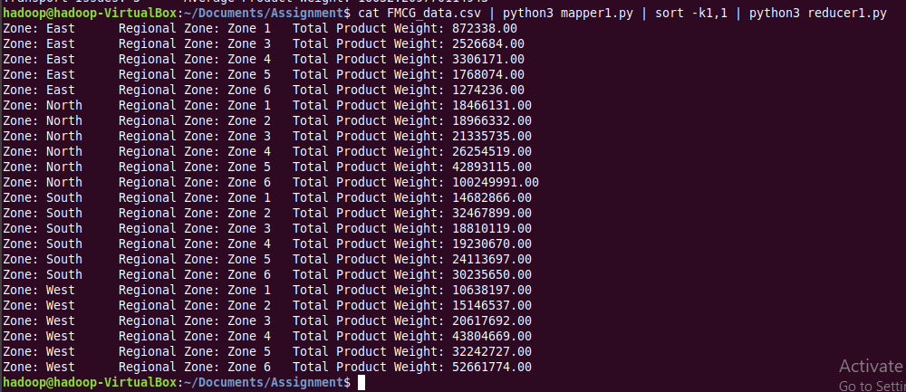
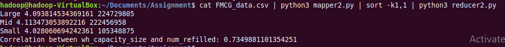
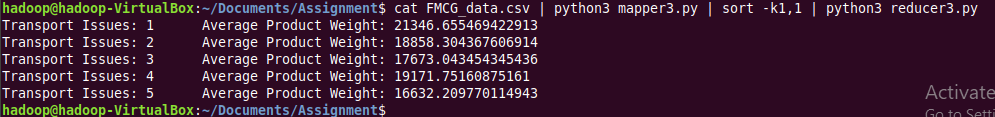
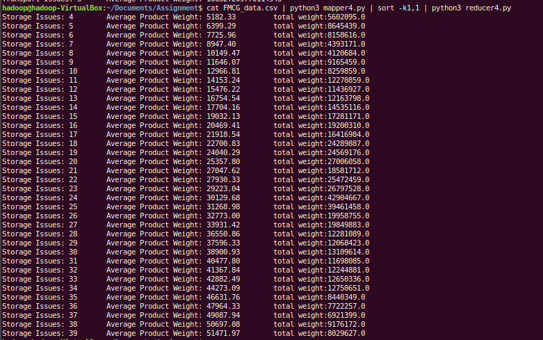

# Assignment 6

### **Task 1**
#### Demand-Supply Mismatch Analysis
Objective: Identify zones and regional zones with the highest mismatch between demand and supply.
Required Fields: zone, WH_regional_zone, product_wg_ton
Description:
Map: For each warehouse, emit the zone and regional zone as the key and the product weight shipped in the last three months as the value.
Reduce: Aggregate the product weight by zone and regional zone to calculate the total supply. Compare this with known demand data to identify mismatches.

**Mapper**
```
#!/usr/bin/python3
"""mapper1.py"""
import sys

# input comes from standard input
for line in sys.stdin:
	line = line.strip()
	if line:
		columns = line.split(',')
		if columns[4] != "zone" or columns[5] != "WH_regional_zone" or columns[-1] != "product_wg_ton":
			zone = columns[4].strip()
			regional_zone = columns[5].strip()
			product_wg = columns[-1].strip()
			print('%s,%s,%s' % (zone, regional_zone, product_wg))
```

**Reducer**
```
#!/usr/bin/python3
"""reducer1.py"""
import sys
from collections import defaultdict

zone = None
reg_zn = None
zone_wt = defaultdict(lambda: defaultdict(list))

# Read input from stdin
for line in sys.stdin:
    zone, reg_zn, weight = line.strip().split(',')
    try:
        weight = float(weight)
        zone_wt[zone][reg_zn].append(weight)
    except ValueError:
        continue


for zone, WH in zone_wt.items():
    for region, weights in WH.items():
        total = sum(weights)
        print(f"Zone: {zone}\tRegional Zone: {region}\tTotal Product Weight: {total:.2f}")


```

**Output**


### **Task 2**
#### Warehouse Refill Frequency Correlation
Objective: Determine the correlation between warehouse capacity and refill frequency.
Required Fields: WH_capacity_size, num_refill_req_l3m
Description:
Map: Extract the number of refill requests (num_refill_req_l3m) and warehouse capacity size (WH_capacity_size) for each warehouse. (For each warehouse, emit the capacity size and the number of refill requests as the value)

Reduce: Aggregate the refill requests by capacity size and calculate the correlation.

**Mapper**
```
#!/usr/bin/python3
"""mapper2.py"""
import sys
# input comes from standard input
for line in sys.stdin:
    # remove leading and trailing whitespace
    line = line.strip()
    # If the line is not empty
    if line:
        columns = line.split(',')
        if columns:
            capacity_size = columns[3].strip()
            num_refill_req_l3m = columns[6].strip()
            ton = columns[-1].strip()

            if capacity_size != "capacity_size" and num_refill_req_l3m != "num_refill_req_l3m":
                print('%s,%s,%s' % (capacity_size, num_refill_req_l3m, ton))
```

**Reduced**
```
#!/usr/bin/python3
"""reducer2.py"""

import sys
import numpy as np

data={}
encode = {'Large':3,'Mid':2, 'Small':1}

# input comes from STDIN

for line in sys.stdin:
    line = line.strip()

    capacity, refill, ton = line.split(",")
    try:
        refill = int(refill)
        ton = int(ton)
    except:
        continue

    if capacity in data:
        data[capacity][0]+=refill
        data[capacity][1]+=1
        data[capacity][2]+=ton
    else:
        data[capacity]=[refill,1,0]

values=[]
sizes=[]

for k, v in data.items():
    avg = v[0]/v[1]
    values.append(avg)
    sizes.append(encode[k])
    print(f"{k} {avg} {v[2]}")


correlation_matrix = np.corrcoef(sizes, values)

correlation_xy = correlation_matrix[0, 1]

print("Correlation between wh_capacity_size and num_refilled:", correlation_xy)
```

**Ouput**



### **Task 3**
#### Transport Issue Impact Analysis
Objective: Analyse the impact of transport issues on warehouse supply efficiency.
Required Fields: transport_issue_l1y, product_wg_ton

Description:
Map: For each warehouse, emit whether a transport issue was reported and the product weight
shipped.
Reduce: Aggregate the product weight by transport issue status to assess the impact.

**Mapper**
```
#!/usr/bin/python3
"""mapper2.py"""
import sys

# input comes from standard input

for line in sys.stdin:
        line = line.strip()
        if line:
                columns = line.split(',')
                if columns[7] != "transport_issue_l1y," or columns[-1] != "product_wg_ton":
                        transport_issue = columns[7].strip()
                        product_wg = columns[-1].strip()
                        print('%s,%s' % (transport_issue, product_wg))
```

**Reducer**
```
#!/usr/bin/python3
"""reducer3.py"""
import sys
from collections import defaultdict

issues = None
wt_issues = defaultdict(list)
ct_issue = defaultdict(int)

for line in sys.stdin:
    issues, weight = line.strip().split(',')
    try:
        weight = float(weight)
        if int(issues) > 0:
            wt_issues[issues].append(weight)
            ct_issue[issues] += 1
    except ValueError:
        continue

wt_issues = dict(sorted(wt_issues.items(), key=lambda x: x[0]))


for val in wt_issues:
    weights = wt_issues[val]
    average_weight = sum(weights) / len(weights)
    print(f"Transport Issues: {val}\t Average Product Weight: {average_weight}")
```

**Output**



### **Task 4**
#### Storage Issue Analysis
Objective: Evaluate the impact of storage issues on warehouse performance.
Required Fields: storage_issue_reported_l3m, product_wg_ton
Description:
Map: For each warehouse, emit whether a storage issue was reported and the product weight shipped.
Reduce: Aggregate the product weight by storage issue status to assess the impact.

**Mapper**
```
#!/usr/bin/python3
"""mapper2.py"""
import sys

# input comes from standard input
for line in sys.stdin:
        line = line.strip()
        if line:
                columns = line.split(',')
                if columns[-6] != "storage_issue_reported_l3m,," or columns[-1] != "product_wg_ton":
                        storage_issue = columns[-6].strip()
                        product_wg = columns[-1].strip()
                        print('%s,%s' % (storage_issue, product_wg))
```

**Reducer**
```
#!/usr/bin/python3
"""reducer4.py"""
import sys
from collections import defaultdict

issues = None
wt_issue = defaultdict(float)
ct_issue = defaultdict(float)


for line in sys.stdin:
	issues, weight = line.strip().split(',')
	try:
		issues = int(issues)
		weight = float(weight)
		if issues > 0:
			wt_issue[issues] += weight
			ct_issue[issues] += 1
	except ValueError:
        	continue

wt_issue = dict(sorted(wt_issue.items(), key=lambda x: x[0]))

for val in wt_issue:
	print(f"Storage Issues: {val}\t Average Product Weight: {wt_issue[val]/ct_issue[val]:.2f}\t total weight:{wt_issue[val]}")
```

**Ouput**

