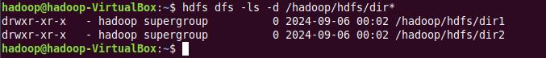
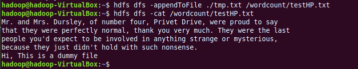

# Assignment 5

### A. Create a directory /hadoop/hdfs/ in HDFS 
- `hdfs dfs -mkdir /hadoop/hdfs`

### B. Create a temp directory in Hadoop. Run HDFS command to delete “temp” directory.

- `hdfs dfs -mkdir /temp`
- `hdfs dfs -rm /temp`

### C. List all the files/directories for the given HDFS destination path.
- `hdfs dfs -ls /`

### D. Command that will list the directories in /hadoop folder.
- `hdfs dfs -ls /hadoop `

### E. Command to list recursively all files in hadoop directory and all subdirectories in hadoop directory.
- `hdfs dfs -ls -R /hadoop`

### F. List all the directories inside /hadoop/hdfs/ directory which start with 'dir'.
- `hdfs dfs -ls /hadoop/hdfsdir*`

### G. Create a temp.txt file. Copy this file from the local file system to HDFS.
- `touch temp.txt`
- `hdfs dfs -put temp.txt /hadoop/hdfs`

### H. Copy the file from HDFS to the local file system.
- `hdfs dfs -get hadoop/hdfs/temp.txt /.`

### I. Command to copy from local directory with the source being restricted to a local file reference.
- `hdfs dfs -put /temp1.txt /hadoop/hdfs`

### J. Command to copy to a local directory with the source being restricted to a local file reference.
- `hdfs dfs -get /hdoop/hdfs/temp.txt ./home`

### K. Command to move from the local directory source to Hadoop directory.
- `hdfs dfs -moveFromLocal /temp2.txt /hadoop/hdfs`

### L. Delete the directory and any content under it recursively.
- `hdfs dfs -rm -r /hadoop/hdfs`

### M. List the files and show format file sizes in a human-readable fashion.
- `hdfs dfs -du -h /wordcount`

### N. Take a source file and output the file in text format on the terminal.
- `hdfs dfs -cat tmp.txt`

### O. Display the content of the HDFS file test on your /user/hadoop2 directory.
- `hdfs dfs -cat /wordcount/testHP.txt`

### P. Append the content of a local file test1 to an HDFS file test2.
- `hdfs dfs -appendToFile /tmp.txt /wordcount/testHP.txt`

### Q. Show the capacity, free, and used space of the filesystem.
- `hdfs dfs -df`

### R. Show the capacity, free, and used space of the filesystem. Add parameter formats the sizes of files in a human-readable fashion.
- `hdfs dfs -df -h`

### S. Show the amount of space, in bytes, used by the files that match the specified file pattern.
- `hdfs dfs -du -s /wordcount/testHP.txt`

### T. Show the amount of space, in bytes, used by the files that match the specified file pattern. Format the sizes of files in a human-readable fashion.
- `hdfs dfs -du -h /wordcount/testHP.txt`

### U. Check the health of the Hadoop file system.
- `hdfs fsck / `

### V. Command to turn off the safemode of Name Node.
- `hdfs dfsadmin -safemode leave`

### W. HDFS command to format NameNode.
- `hdfs namenode -format`

### X. Create a file named hdfstest.txt and change its number of replications to 3.

- `hdfs dfs -setrep 3 /wordcount/testHP.txt`

### Y. Write command to display the number of replicas for hdfstest.txt file.
- `hdfs dfs -stat %r /wordcount/testHP.txt`

### Z. Write command to display the status of file “hdfstest.txt” like block size, file size in bytes.
- `hdfs dfs -stat /wordcount/testHP.txt`

### AA. Write HDFS command to change file permission from rw-r--r-- to rwxrwxr-x for hdfstest.txt.
- `hdfs dfs -chmod 761 /wordcount/testHP.txt`

